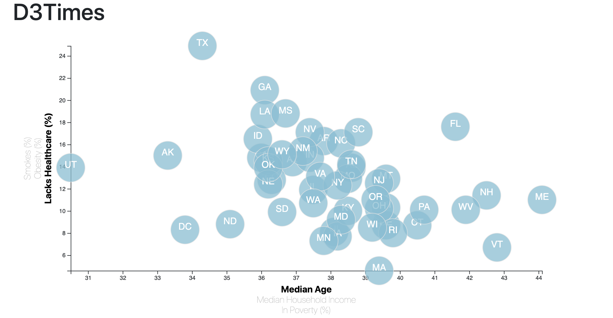
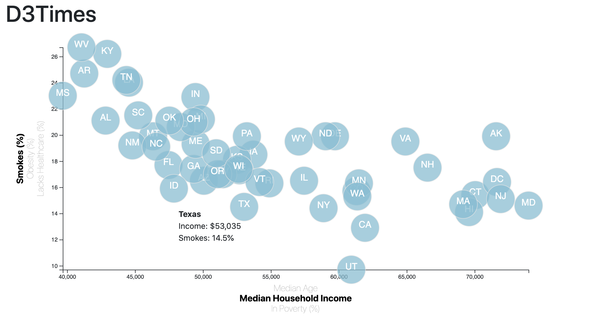

# D3 Challenge - Interactive Scatterplot 

Created interactive scatterplot with using census data. The user can visualize state by state comparisons of age, income, or poverty with healthcare, smoking, or obesity.

## Table of contents

* [Technologies](#technologies)
* [Installation](#installation)
* [Development Process](#development-process)
* [Data Sources](#data-sources)
* [Contact](#contact)

## Technologies

* Javascript:
  * jQuery - version 3.3.1
  * Popper.js - version 1.24.3
  * d3 - version 5.16.0
  * d3.tip - version 0.7.1
* HTML & CSS
  * Bootstrap - version 4.1.3

## Installation and Usage
Installation: 
1. Link Bootstrap stylesheet in index header for HTML visualization and functionality.
2. Link style.css and d3style.css into header for HTML and javascript styling.
3. Link jQuery, Popper.js, d3, d3 tip scripts in index body for javascript and bootstrap functionality.
4. Reference assets/js/app.js in index body to link to javascript file. 

Usage:
1. Horizontal Asis: Select "Median Age," "Median Household Income," or "In Poverty(%)" to change datasets. 
2. Vertical Axis: Select "Smokes(%)," "Obesity(%)," or "Lacks Healthcare(%)"to change  datasets. 
3. Scroll mouse over different states to view values for selected axis data.

## Development Process

* Used d3 to bind the data to the HTML document, then built an interactive scatterplot to visualize demographic data.  

## Data Sources
* [Link to 2014 Census Data](D3_data_journalism/assets/data/data.csv)
* Data sourced from: US Census Data. Retrieved from: [https://factfinder.census.gov/faces/nav/jsf/pages/searchresults.xhtml](https://factfinder.census.gov/faces/nav/jsf/pages/searchresults.xhtml)

## Contact
Created by [Katy Luquire](https://github.com/CatherineLuquire)
